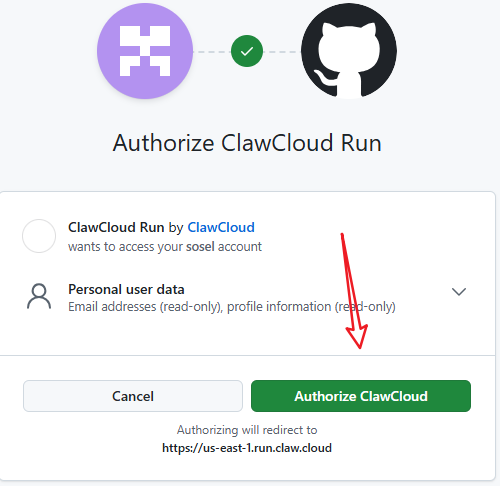
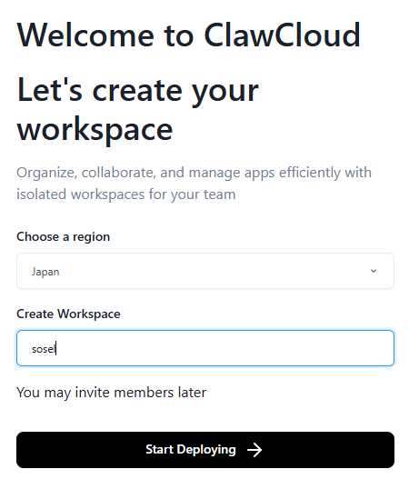
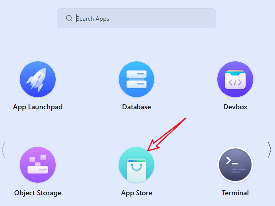
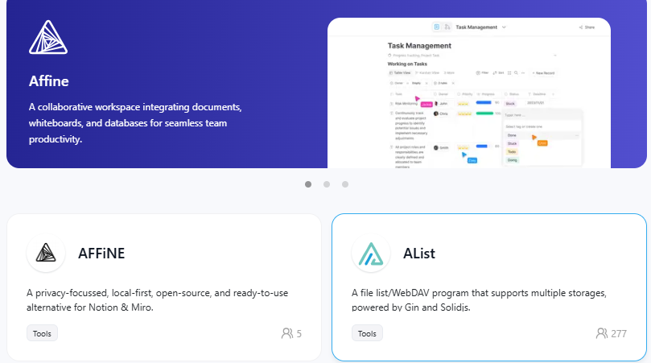
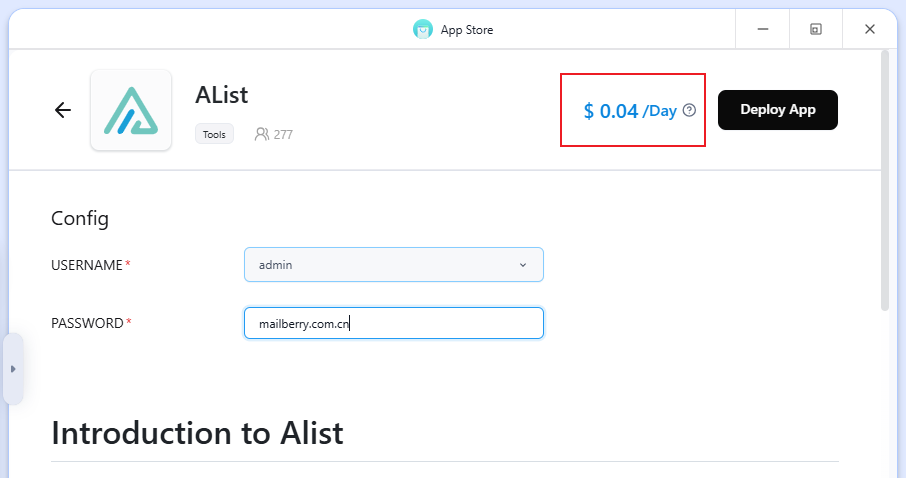
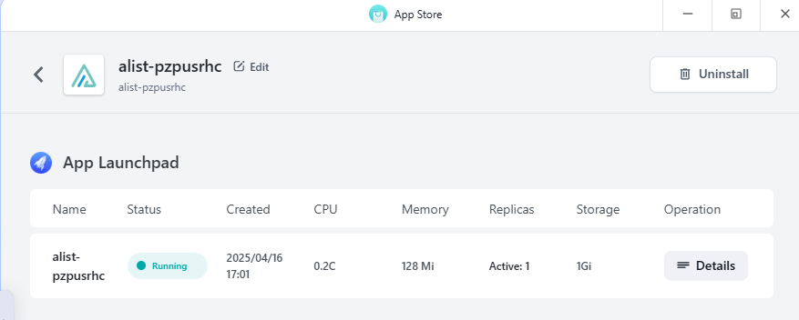
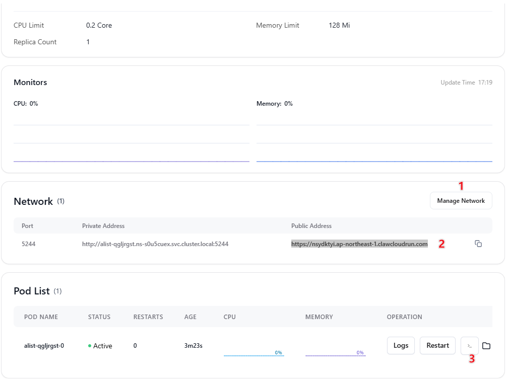
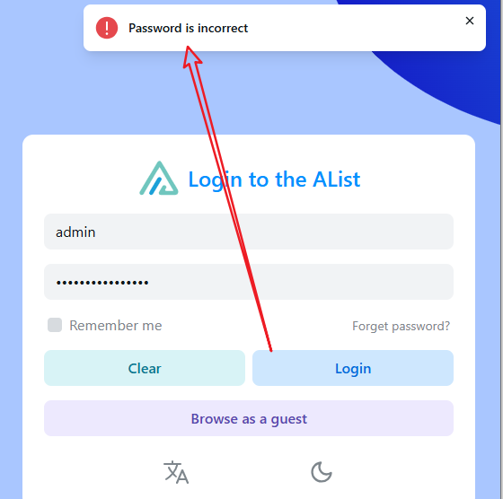
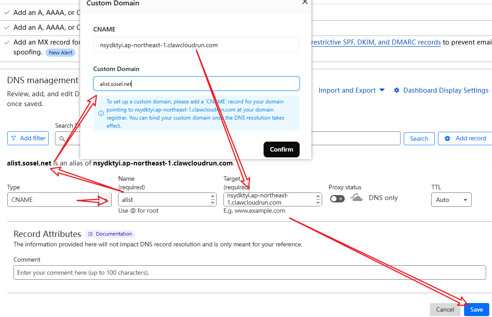
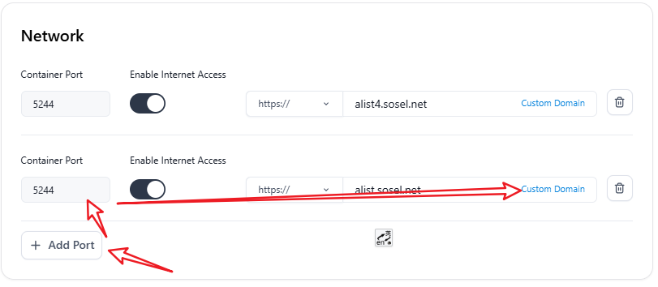

## Introduction

Claw is a relatively new cloud service provider that has emerged in recent years. Its service routes are largely aligned with Alibaba Cloud, but it offers significantly better value for money. You can think of it as an unofficial "offspring" of Alibaba Cloud—similar to how Redmi is to Xiaomi. By adopting a different brand, Claw sidesteps certain legal and policy constraints. But let’s not digress—today, we’re focusing on how to take advantage of their newly launched free container offering, which can provide up to 4 cores and 8 GB of RAM.

## Application

Claw currently offers new users a $5 free credit for the first month. If you have a GitHub account that’s more than 180 days old, you can receive a $5 monthly credit indefinitely. As long as you stay within this credit limit, you can essentially enjoy the service for free—forever.


Go to the homepage:
 👉 [https://run.claw.cloud](https://console.run.claw.cloud/signin?link=QVC1LIXKEWVM)

Sign in using your GitHub account:



Authorize the login:



Choose a region, create a container space name, and click **Start Deploying** to begin the deployment process.

## Installing Alist

After logging into the Claw control panel:



Click on the **App Store**:



You’ll easily spot the Alist app in a prominent location:



Choose a username and password. Note the cost displayed above: $0.04/day. Even at 31 days/month, that’s only $1.24—well within the $5 monthly credit.

Click **Deploy App** to proceed.



That’s it! Your Alist app is now deployed.

Click **Details**:



1. **Manage Network** – This is where you'll configure custom domains (covered later).
2. **Public Address** – Use this to access your app. This is also the target for your domain's CNAME record.
3. **SSH Commands** – Manage your container via SSH.

## Setting a Password

When I tried accessing the app using the username and password I just set, I got a “Password is incorrect” error:



A bit awkward—I was certain I didn’t enter the wrong password (I even double-checked with a screenshot!). You can reinstall the app, or simply reset the password via SSH.


Scroll to the bottom of the **Details** page and open the SSH command management interface. Run the following command:

```
./alist admin set yourpassword
```

This will reset your Alist admin password.

## Binding a Custom Domain

Go to the **Details** page → **Manage Network** → **Custom Domain**:


Here’s an example using a Cloudflare-managed domain:

Go to your domain registrar or DNS provider and add a new CNAME record. Set the subdomain (e.g., `alist`) and point it to the address provided by Claw. Disable the proxy (little cloud icon), save the changes, then return to Claw and click **Confirm** to finalize the binding.



Finally, click **Update** in the top right corner of the Claw **Details** page to apply the changes.

## Custom Domain Issues

> ⚠️ **Note**
>  There’s a known bug: If you don’t set a custom domain **at the time of container creation**, the CNAME address may change after updating, leading to resolution failure.



To fix this, add a new port using **Add Port**, set the custom domain there directly, then delete the previous one and click **Update**. This prevents the CNAME from changing unexpectedly.

## Summary

If your GitHub account is over 180 days old, you can receive $5 in monthly credits—enough to run lightweight apps for free, permanently. There’s no need to bind a credit card or worry about unexpected charges. It’s a great option for personal projects, testing, or learning.
