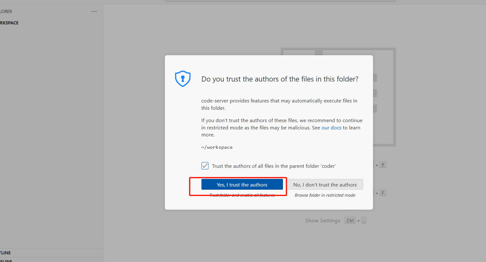

# MCP Development Using Claw Cloud Platform

## Introduction

This guide demonstrates how to use the Claw Cloud Platform with VS Code for MCP (Model Context Protocol) development and experimentation. MCP enables seamless integration between AI models and tools, creating powerful AI agents that can interact with external services.

## Prerequisites

Before starting, please ensure you have:

- A Google account or GitHub account (GitHub accounts older than 180 days are recommended as they qualify for $5 free monthly credit without requiring a credit card)
- API keys for the services you plan to integrate with your MCP agent

## Account Registration

1. Register using the following referral link:
   [https://console.run.claw.cloud/signin?link=7D47LG72PBLB](https://console.run.claw.cloud/signin?link=7D47LG72PBLB)


## Container Deployment

1. After logging in, navigate to the App Store from the dashboard, then select and deploy the **code-server** application.


2. Wait until the container status changes to "Running", then click on "Details" to access configuration options.


3. Scroll down to the Network section and locate the Public URL. Click on this URL to access your VS Code environment.


## VS Code Configuration

1. When prompted, enter the default password `sealos123`. You can view or change this password in the container details page.


2. Once inside the VS Code interface, click "Yes, I trust the authors" when prompted to trust the workspace.



3. Install the necessary extensions by clicking on the Extensions icon in the sidebar. For this MCP development tutorial, we'll install Python and Cline extensions.


4. Add Python to your PATH environment variable by executing the following commands in the terminal:
```bash
echo 'export PATH="/bin:$PATH"' >> ~/.bashrc
source ~/.bashrc
```


5. Set up pip and install uv (a modern Python package manager) with these commands:
```bash
python3 -m ensurepip --upgrade
python3 -m pip install uv
```

6. Initialize your MCP project and create a virtual environment:
```bash
cd /home/coder/workspace
python3 -m uv init opaoai
cd opaoai
python3 -m uv venv
source .venv/bin/activate
python3 -m uv add "mcp[cli]"
touch server.py
```


7. Add the following code to your `server.py` file:
```python
from mcp.server.fastmcp import FastMCP

# Initialize FastMCP server (stdio mode)
mcp = FastMCP("opaoai", mode="stdio")

# Mock user database
user_database = {
    "John": "13800138000",
    "Mary": "13900139000",
    "Tom": "13700137000"
}

@mcp.tool()
def get_userphone(username: str) -> str:
    """Get user's phone number by username
    
    Args:
        username: The username to look up
        
    Returns:
        The user's phone number, or a message if user not found
    """
    if username in user_database:
        return user_database[username]
    else:
        return f"Phone number for user {username} not found"

# Start the server (stdio mode doesn't need host and port)
if __name__ == "__main__":
    mcp.run()
```

## Testing Your MCP Service

1. Open the Cline extension and configure it with your API key.


2. Navigate to the MCP configuration section in Cline.


3. Add the following configuration to connect to your MCP service:
```json
{
  "mcpServers": {
    "opaoai": {
      "command": "bash",
      "args": [
        "-c",
        "cd /home/coder/workspace/opaoai && source .venv/bin/activate && python3 server.py"
      ]
    }
  }
}
```


4. Start a new Cline task and enter your query. For example:
   `Please help me find John's phone number using the MCP service.`

   The AI will use your MCP service to fetch and return John's phone number.


## Extending Your MCP Service

Now that you have a working MCP service, you can extend it with additional capabilities:

- Add more tools by creating new functions with the `@mcp.tool()` decorator
- Integrate with external APIs and databases
- Create more complex tool pipelines
- Add authentication and security features

For detailed documentation on MCP development, visit the [official MCP documentation](https://modelcontextprotocol.io/introduction).

## Acknowledgements

I would like to express my sincere gratitude to the Claw Cloud Platform for providing free services that make projects like this possible. Also, a special thanks to all the open-source contributors.

For more open-source projects and tutorials, visit: [https://github.com/ClawCloud/Run-Blog](https://github.com/ClawCloud/Run-Blog)

Enjoy developing with your AI Agent!