# Deploying Your Official QQ Bot Using [Claw Cloud Platform](https://run.claw.cloud/)

## Table of Contents
- [Introduction](#introduction)
- [Preparation](#preparation)
- [Account Registration](#account-registration)
- [Container Deployment](#container-deployment)
- [QQ Bot Configuration](#qq-bot-configuration)
- [Adding AI Model Service](#adding-ai-model-service)
- [Adding Baidu Maps MCP Service (Advanced Optional Feature)](#adding-baidu-maps-mcp-service-advanced-optional-feature)
- [Conclusion](#conclusion)
- [Acknowledgements](#acknowledgements)

## Introduction

This tutorial will guide you through deploying your own official QQ bot using the [Claw Cloud Platform](https://run.claw.cloud/).

## Preparation

Before starting, you need to prepare the following:

- A Google account or GitHub account (GitHub account recommended as those more than 180 days old can get $5 free credit monthly without requiring a credit card)
- API keys for various platforms
- Baidu Maps API key (for MCP service, optional)

## Account Registration

1. Click the following link to register (includes referral):
   [https://console.run.claw.cloud/signin?link=7D47LG72PBLB](https://console.run.claw.cloud/signin?link=7D47LG72PBLB)


## Container Deployment

1. After registration, click **App Launchpad** --- then click **Create App**

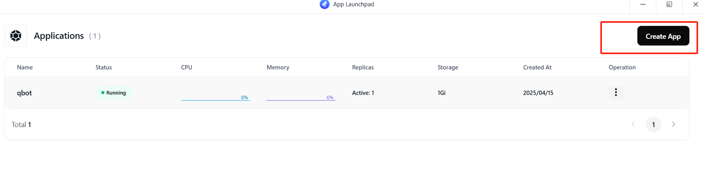

2. Modify the image to: `soulter/astrbot:latest`  
   2.1 You can customize the **Application Name** according to your preference to differentiate between containers  
   2.2 Select **Public** for the image and change the **Image** name to `soulter/astrbot:latest`  
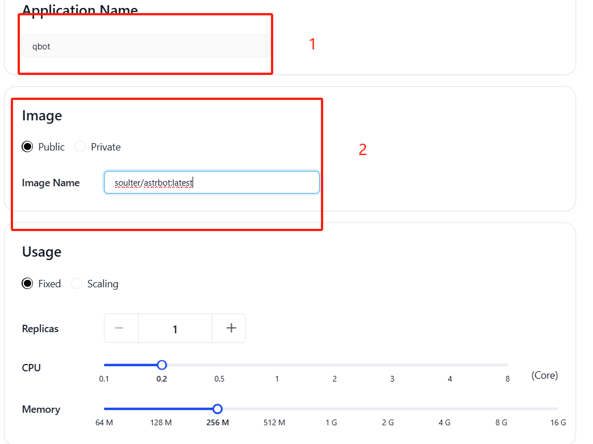

3. You can select **Fixed** and set the container count to 1. You can adjust CPU and memory based on your needs. For lightweight usage, the default settings are sufficient.
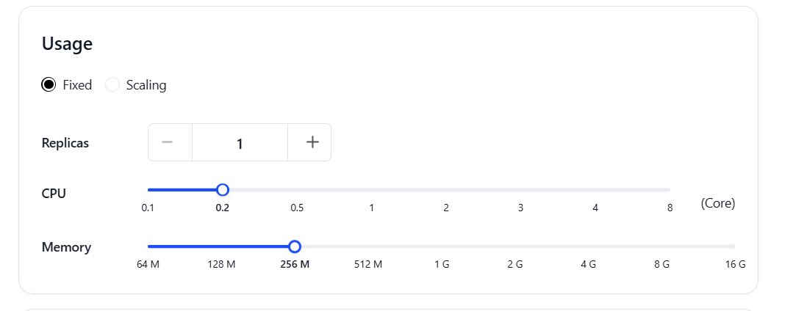

4. **Enable external** access to the container and add two container ports: 6185 and 6196, while enabling external access to container ports
   (You can customize multiple ports if you need to deploy multiple bots simultaneously)
   
   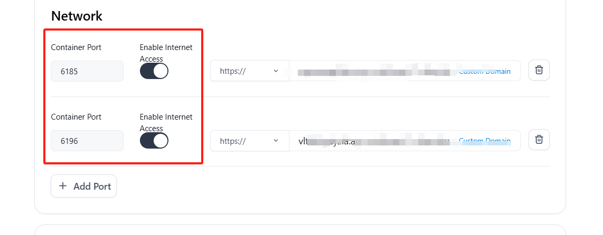
   
5. Add necessary **Environment variables** and file storage  
   As shown below, add the environment variable `TZ=Asia/Shanghai`   
   Add local storage for `/AstrBot/data`
   
   
6. Finally, click the **Deploy Application** button in the upper right corner
    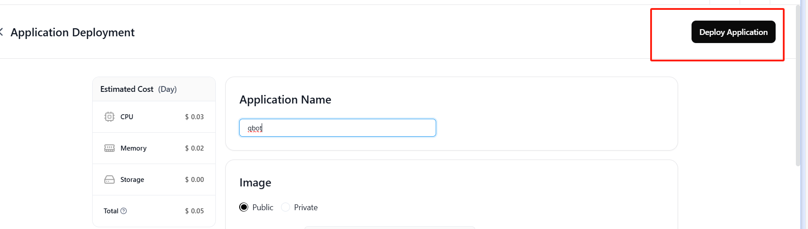

## QQ Bot Configuration

1. Click to open the domain corresponding to port 6185--as shown in position 1 in the image above, select the domain corresponding to **Public Address**
   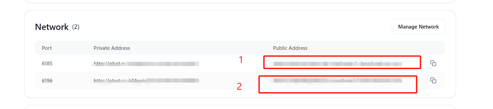
   
2. Log in using the default username and password (both are `astrbot`)
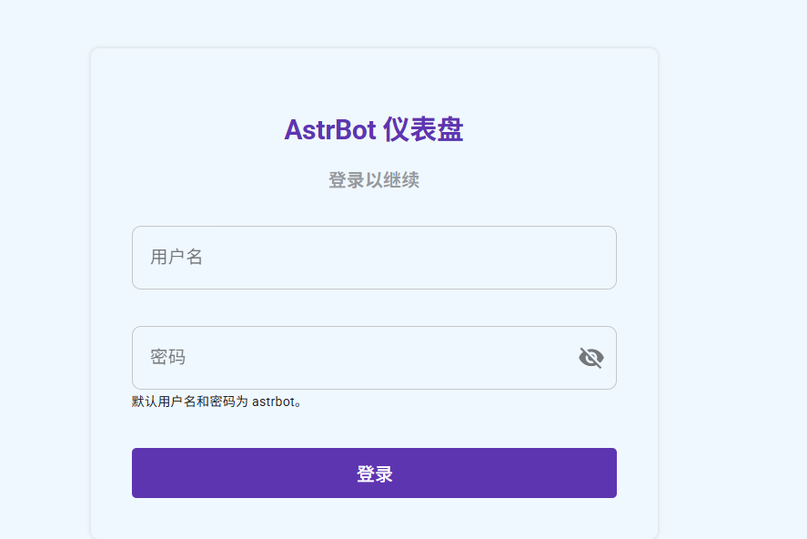

3. Click "Message Platform" and add a new QQ bot account
   
   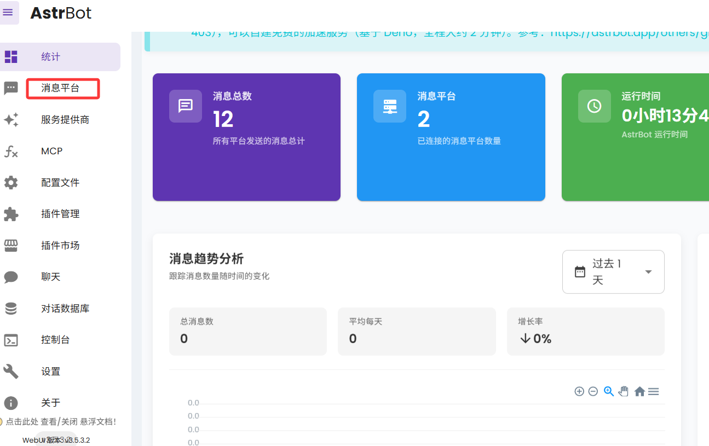
   
4. Select "QQ Official" and "webhook type"
   
   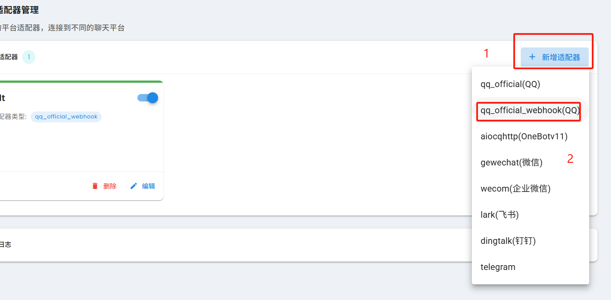
   
5. Fill in the QQ bot ID and secret key

   (For bot application and key viewing, please refer to: [Apply for QQ bot](https://bot.q.qq.com/wiki/#_3-%E4%B8%AA%E4%BA%BA%E4%B8%BB%E4%BD%93%E5%85%A5%E9%A9%BB), [View ID and key](https://q.qq.com/qqbot/#/developer/developer-setting))
   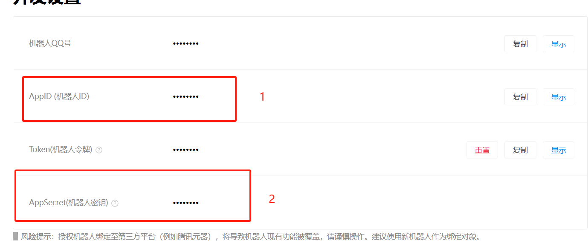
   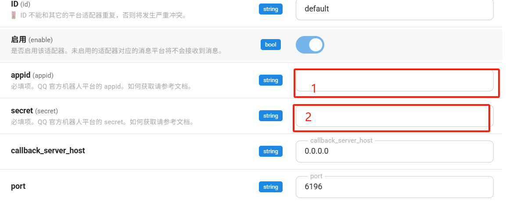

6. After starting the bot, return to the QQ bot platform
7. Navigate to [**Development--Callback Configuration**](https://q.qq.com/qqbot/#/developer/webhook-setting)
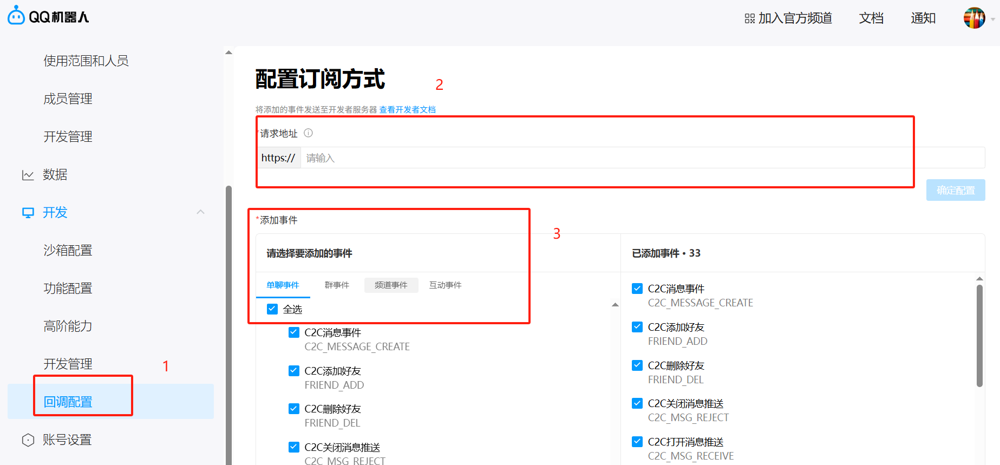

8. Check all four events, then confirm the configuration
9. Fill in the callback address: `<your domain>/astrbot-qo-webhook/callback`
   (The domain here refers to the domain corresponding to the second port 6196)

10. Return to the QQ bot platform and check your logs. If everything is working correctly, it should show your QQ bot has logged in successfully


Additional configuration:
If step 10 shows that your QQ bot failed to start and displays "not in whitelist," you need to use [itdog](https://www.itdog.cn/) to ping your domain, get your IP address, and then add the obtained address to the whitelist IP in the QQ bot platform
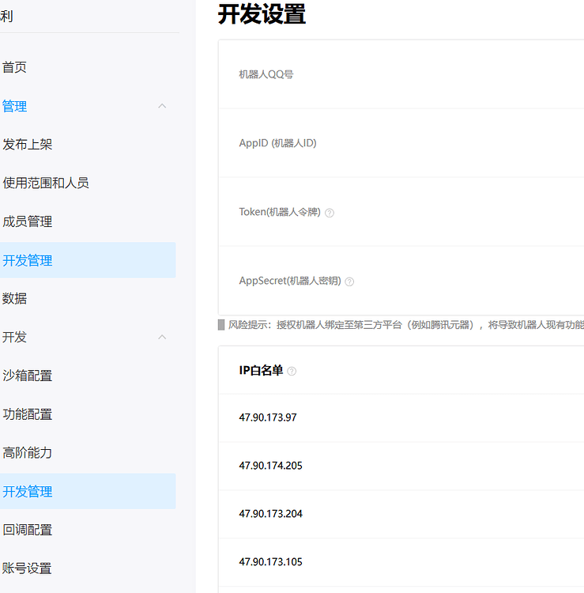

## Adding AI Model Service

1. Add an AI model service based on the API you own
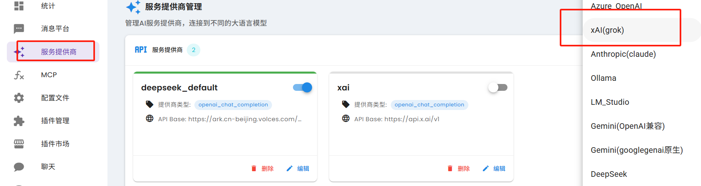

2. After configuration, restart the service
3. Wait 3-5 minutes, and your bot will be ready for conversation
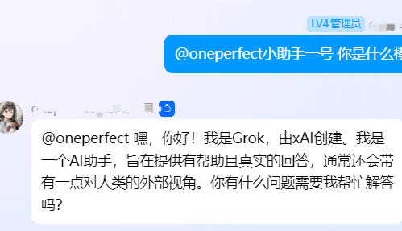

## Adding Baidu Maps MCP Service (Advanced Optional Feature)

1. You need to create a server-side AK in the [Baidu Maps Open Platform](https://lbsyun.baidu.com/apiconsole/key) console. This AK allows you to call Baidu Maps API capabilities.
2. Go to the Baidu Maps MCP [open-source repository](https://github.com/baidu-maps/mcp/tree/main/src/baidu-map/python) and download the source code
3. Upload the downloaded source code to your Claw cloud container platform
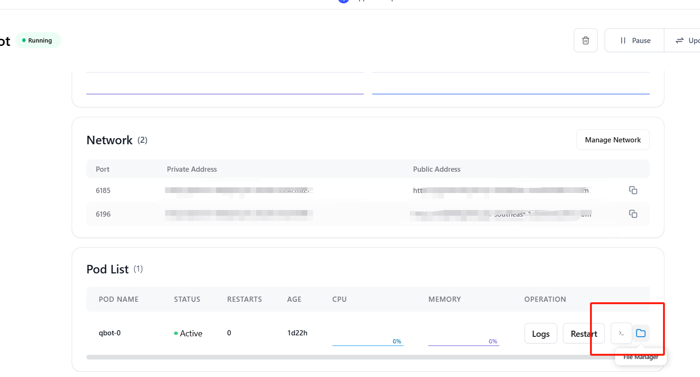
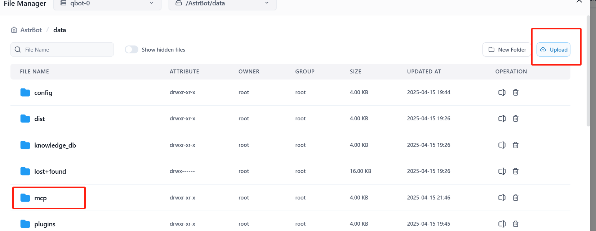

4. Return to your QQ bot platform, navigate to the Console, click on pip install, and install the UV library


5. Navigate to MCP, select "Add New Server" in the upper right corner, and enter the following configuration
```
{
  "mcpServers": {
    "baidu-map": {
      "command": "uv",
      "args": [
        "mcp[cli]",
        "mcp",
        "run",
        "{YOUR_PATH}/mcp_server_baidu_maps/map.py"
      ],
      "env": {
        "BAIDU_MAPS_API_KEY": "<YOUR_API_KEY>"
      }
    }
  }
}
```

> **Note**: Replace `{YOUR_PATH}` with the actual path where you uploaded the Baidu Maps MCP service code, and replace `<YOUR_API_KEY>` with the API Key you obtained from the Baidu Maps Open Platform.

6. Click the "Start" button to run your MCP service. After successful startup, your QQ bot will have the ability to query maps, plan routes, and provide other geographic location services.

## Conclusion

Through this tutorial, you have successfully:
- Deployed your own official QQ bot on the Claw Cloud Platform
- Configured basic chat functionality
- Added AI large model support
- Optionally configured Baidu Maps MCP service for enhanced functionality

For more configuration and plugin usage, you can exchange experiences with other users in the QQ discussion group.

## Acknowledgements

I would like to express my sincere gratitude to the Claw Cloud Platform for providing free services that make projects like this possible. Also, a special thanks to all the open-source contributors whose work forms the foundation of tools like AstrBot and related services.

For more open-source projects and tutorials, visit: [https://github.com/ClawCloud/Run-Blog](https://github.com/ClawCloud/Run-Blog)

Enjoy using your bot!


