# Never Offline: Unleashing the Power of Claw Cloud and QLPanel for Free Automation

## Introduction

Are you tired of your automated tasks failing due to unreliable hosting? Looking for a zero-cost solution that keeps your scripts running 24/7? Look no further! This guide unveils the ultimate automation combo: Claw Cloud paired with the powerful Qinglong Panel (QLPanel). 

Whether you're managing cryptocurrency trading bots, web scrapers, or simply automating daily tasks, this stack delivers enterprise-grade reliability without the enterprise price tag. With $5 free monthly credit and no credit card required, you'll discover how to deploy a production-ready automation environment in minutes.

Ready to transform your automation game? Let's dive in!

## Prerequisites

Before starting, please ensure you have:

- A Google account or GitHub account (GitHub accounts older than 180 days are recommended as they qualify for $5 free monthly credit without requiring a credit card)
- Basic understanding of container technology (helpful but not required)
- A list of automation scripts you want to run continuously

## Why Choose Claw Cloud Run?

### 🚀 Zero-Cost, Full-Featured Platform
- **Free $5 Monthly Credit**: Run services within the 5% of $100 monthly quota—perfect for personal automation projects and small business needs
- **No Credit Card Required**: The free tier is genuinely free with no hidden charges or surprise bills
- **Cloud-Native Architecture**: Leverage the power of containerized applications with zero infrastructure management

### ⚡ Deploy in Seconds, Not Hours
- **One-Click Deployment**: Skip the DevOps headaches with App Store-style deployment
- **10-Second Setup**: Traditional container setup takes 30+ minutes; Claw Cloud takes seconds
- **Behind the Scenes**: Automated provisioning of compute, storage, and networking—no YAML or CLI arguments needed

### 🔄 Auto-Scaling for Peak Performance
- **Scale Automatically**: Resources adjust instantly when your automation needs more power
- **From 1 to 10,000 Tasks**: Your automation environment remains responsive regardless of workload
- **Sleep Better at Night**: No more 3 AM alerts about crashed systems

### 🔒 Enterprise-Grade Security Included
- **Free HTTPS and Custom Domains**: Automatic TLS certificate management with renewals
- **Secure by Default**: Isolated container environments for enhanced security

## Account Registration

1. Register using the following referral link:
   [https://console.run.claw.cloud/signin?link=7D47LG72PBLB](https://console.run.claw.cloud/signin?link=7D47LG72PBLB)

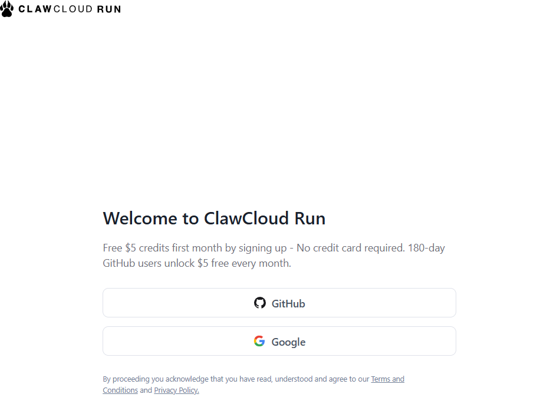

## QLPanel Deployment Guide

1. After logging into your Claw Cloud dashboard, navigate to the homepage and click on the App Store. Search for "qinglong" in the search bar.

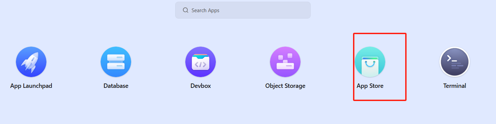
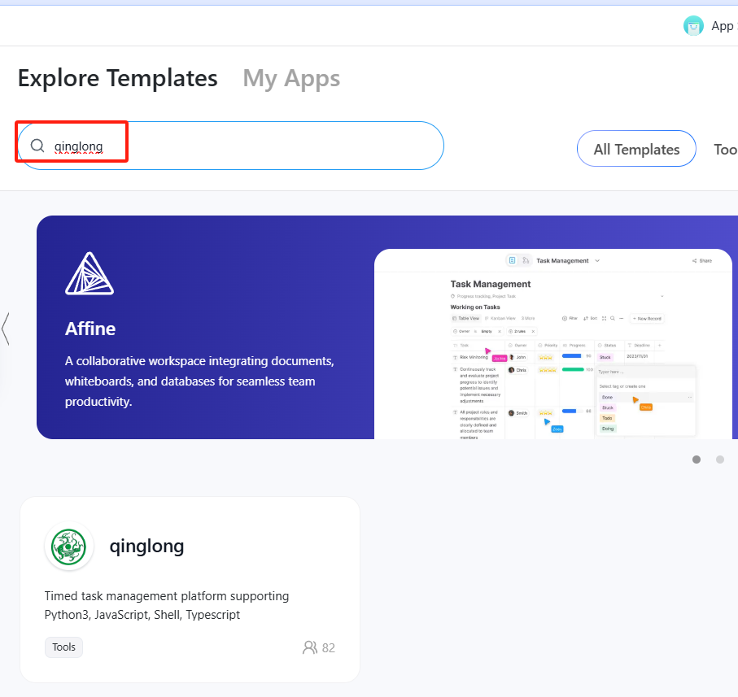

2. Click "Deploy" on the QLPanel (Qinglong) application. This powerful automation panel enables scheduled task execution, script management, and monitoring all in one place. Originally created for cryptocurrency enthusiasts, QLPanel has evolved into a versatile automation hub for any repetitive task.

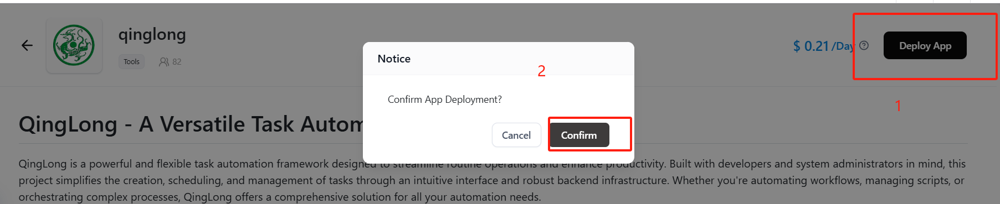

3. Wait for the status to change to "Running," then click "Details" on the right side to view container information.

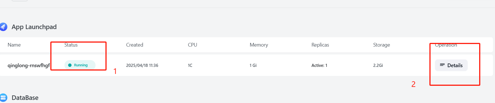

4. Scroll down to the Network Management card and adjust CPU to 0.5. This optimization ensures your automation container runs continuously without shutdowns. With the $5 free monthly credit, this configuration costs only $0.15 per day, providing excellent value for 24/7 operation.
   
   Don't forget to click "Update" after making these changes!

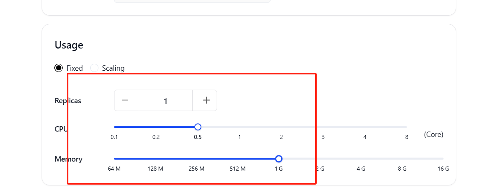
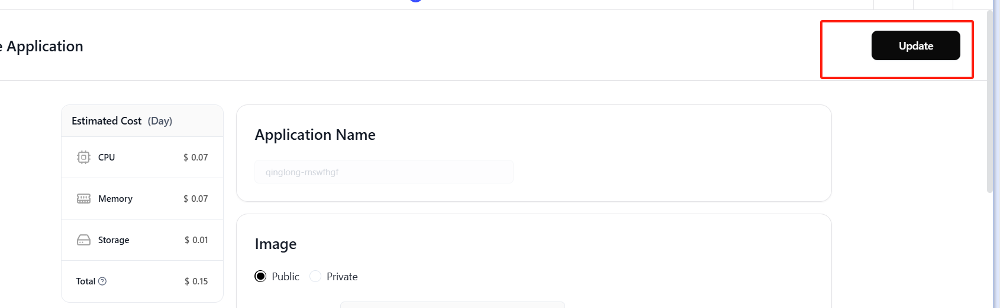
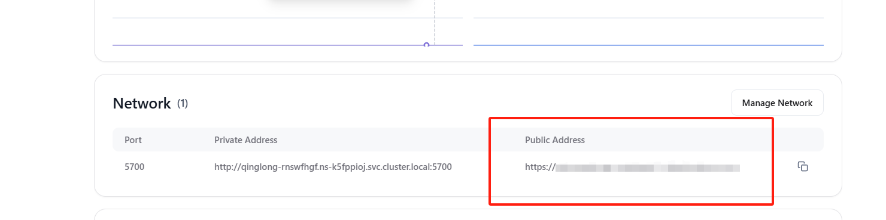

5. Return to the Network Management card and click on the public address domain URL to access your QLPanel.

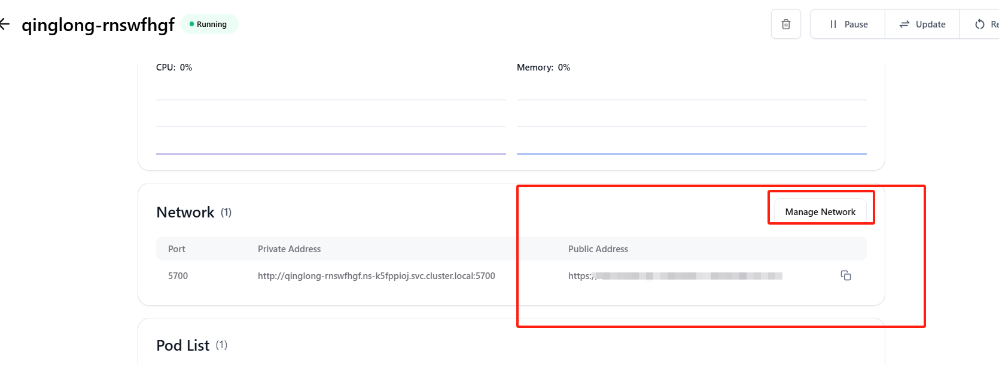

6. Follow the setup wizard to configure your username, password, and notification preferences. QLPanel supports various notification channels including Telegram, Discord, and email.

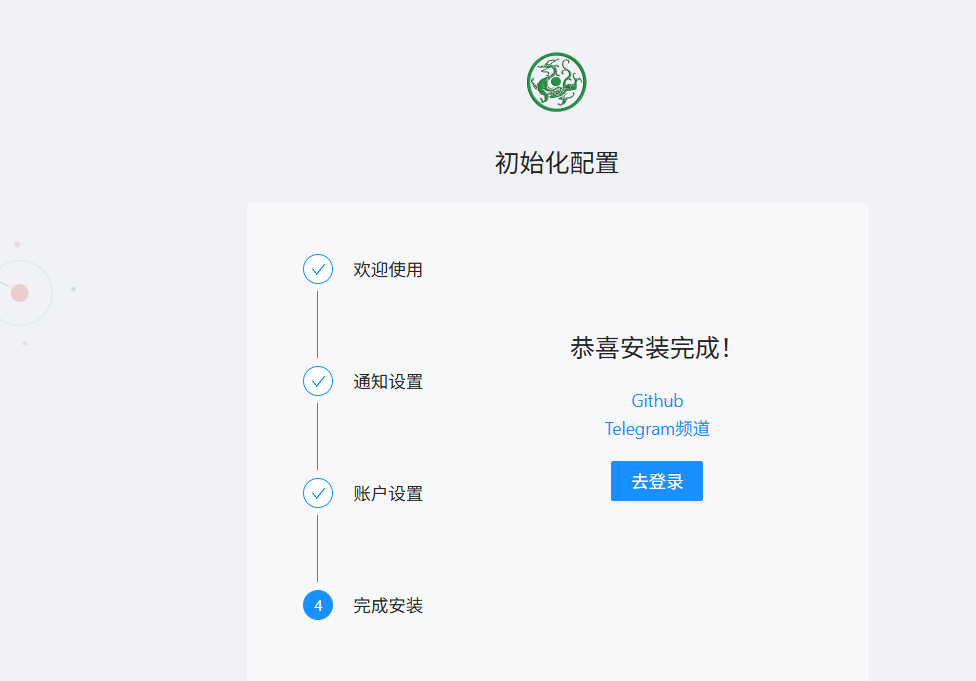

7. After setup completes, you'll be redirected to the login page. Enter the credentials you just created.

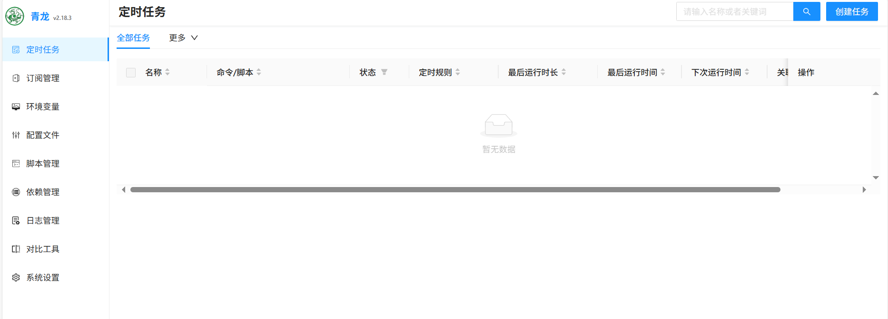

8. You're all set! Now you can deploy and manage automation tasks according to your needs. QLPanel supports JavaScript, Python, Shell, and TypeScript scripts with powerful scheduling options.

## Advanced Tips

- **Persistent Storage**: Your scripts and data are automatically preserved even if the container restarts
- **Environment Variables**: Easily configure secrets and configuration without hardcoding them in your scripts
- **Webhook Integration**: Trigger your tasks via HTTP requests for event-driven automation
- **Developer Experience**: Consider using Claw Cloud's Dev Box for script development—free, unlimited, and accessible from anywhere

## Acknowledgements

I would like to express my sincere gratitude to the Claw Cloud Platform for providing free services that make projects like this possible. Also, a special thanks to all the open-source contributors.

For more open-source projects and tutorials, visit: [https://github.com/ClawCloud/Run-Blog](https://github.com/ClawCloud/Run-Blog)

Enjoy building your automated workflow with Claw Cloud and QLPanel!
