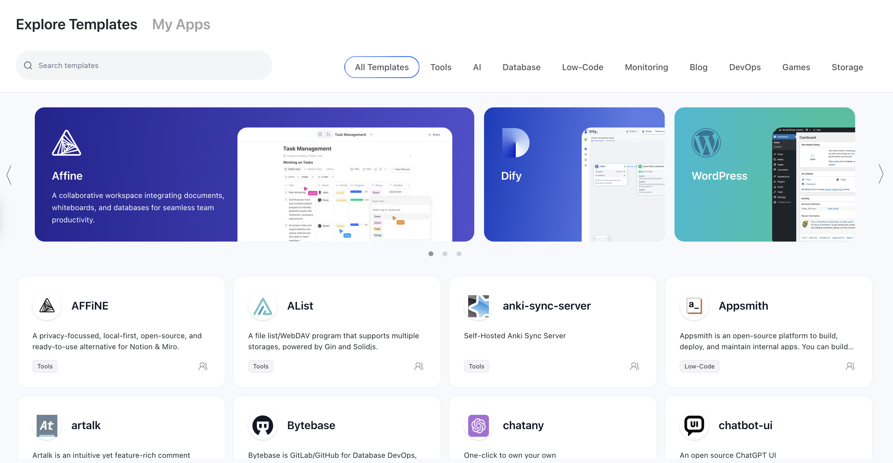

 
*Caption for the image (Optional attribution/source)*

## Introduction  
<!-- Write your content here -->
Explain the problem/context your article addresses. Example:  
"This guide demonstrates how to [do X] using [Tool Y] in [Scenario Z]."

---

## Section 1: Core Concept  
<!-- Use hierarchical headings to organize content -->

- **Key Term**: Brief definition.  
- Use bullet points or numbered lists for clarity:  
  1. First item  
  2. Second item  

---

## Section 2: Step-by-Step Example  
### 2.1 Code Snippet Demo  
```python  
# Code blocks need to be labeled with the language type (e.g. python/bash/yaml)
def placeholder_function():
    print("This is a code example")