# Introduction

After reading the article “[Last mile delivery. Take your cursor code to production for free in just a few clicks.](https://blog.run.claw.cloud/139/)” I got really inspired. My company even reimbursed my Cursor membership so I could try out the latest AI tools. Since I’m not a developer, I never really thought I’d find a use for it. Besides, I’m pretty picky—for instance, I absolutely hate installing too many development components on my computer. As someone who is frequently on the road, I worry that loading up on these tools will hog memory (anyone understand the pain of a stripped-down MBP? 🤪) and drain battery (one charge on a work laptop barely lasts half a day 😣).

Then I discovered ClawCloud Run’s Devbox product (side note: who in their right mind comes up with a product name that long?) and thought it was pretty cool. It automatically connects with Cursor, and since the environments run inside Devbox’s virtual space, I no longer have to worry about cluttering my main machine. Sure, there are other ways to achieve this kind of setup, but Devbox is incredibly convenient.

# What’s the Plan?

Anyone who has ever goofed off at work knows the scenario: a colleague sends you a link—only to reveal a video or a website loaded with explicit images—and then you have to open it on your 27-inch external monitor. Awkward!

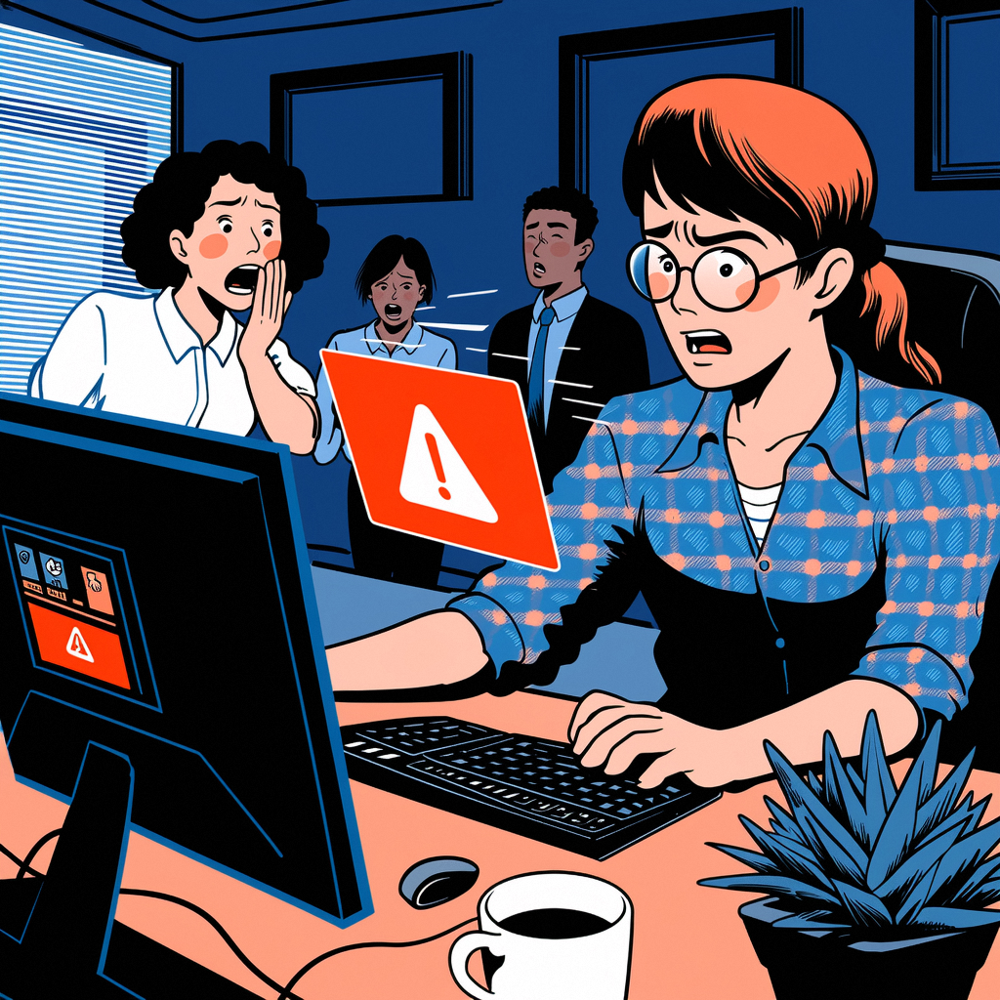

So, I came up with a bright idea 💡—a link checker. Whenever a colleague (especially one known for sending NSFW links) drops a suspicious URL in my inbox, I can run it through this checker first 🧐.

# Let’s Get to Work

1. **Create a Devbox**
    In my limited experience, Python seems ideal for AI-related tasks, so I chose Python as the runtime. Everything else is left at its default.

   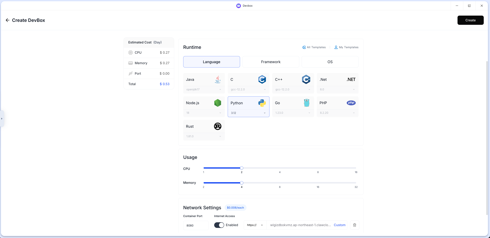

2. **Launch with Cursor**
    Next, simply use the “Action” option to open the Devbox with Cursor.

   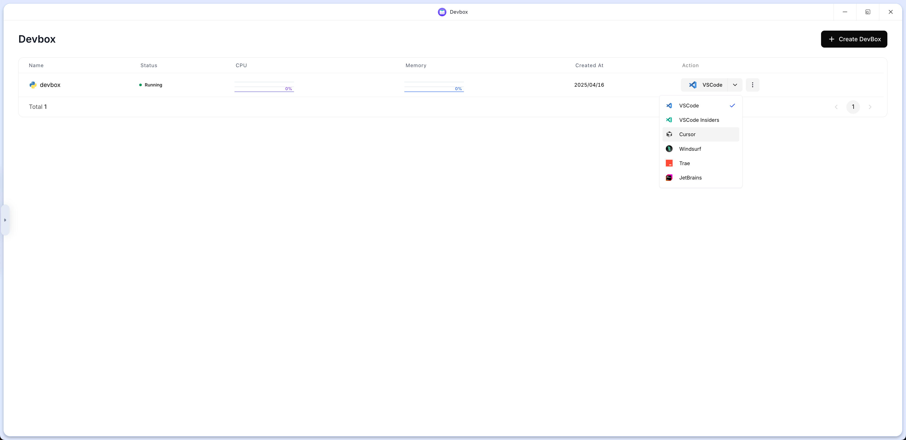

3. **Connect Cursor and Define the Prompt**
    At this point, Cursor automatically connects to the ClawCloud Run Devbox. Now I needed to come up with the prompt for my NSFW detection tool. Of course, I don’t expect Cursor’s model to handcraft a full explicit content detection system from scratch, so I opted to have it use AlibabaCloud’s QWen-VL API—which comes with free multimodal credits—for analysis:

   > **Help me build a NSFW detection tool.**
   >  The tool should provide an HTML interface where I can enter a website URL. It will automatically detect whether the website (including its text, images, and videos) contains any content that is not appropriate for viewing in a workplace environment.
   >
   > Content detection should utilize AlibabaCloud's QWen-VL model. The SDK endpoint for making calls is:
   >  `https://dashscope.aliyuncs.com/compatible-mode/v1`
   >
   > The HTTP endpoint is:
   >  `POST https://dashscope.aliyuncs.com/compatible-mode/v1/chat/completions`
   >
   > My API Key is: `sk-ddf41f99f814435c`

4. **Select Agent Mode and Model**
    I handed the prompt off to Cursor. Based on my experience, selecting the Agent mode automatically figures out the implementation details. I chose the Claude-3.7-sonnet model since reviews online say it produces the best code.

   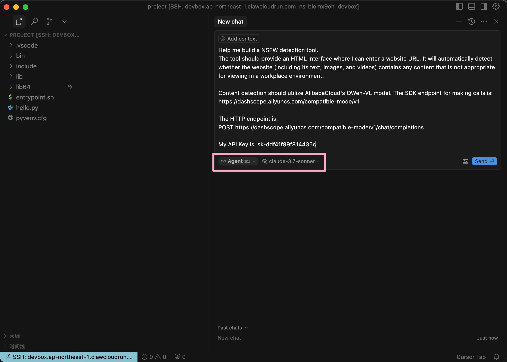

5. **Sit Back and Wait**
    Now, I just sat back and waited while commands and code were generated automatically. For someone like me who can’t write a line of code, being able to describe something in natural language and then see it materialize as working code is absolutely amazing 🤩!!!

   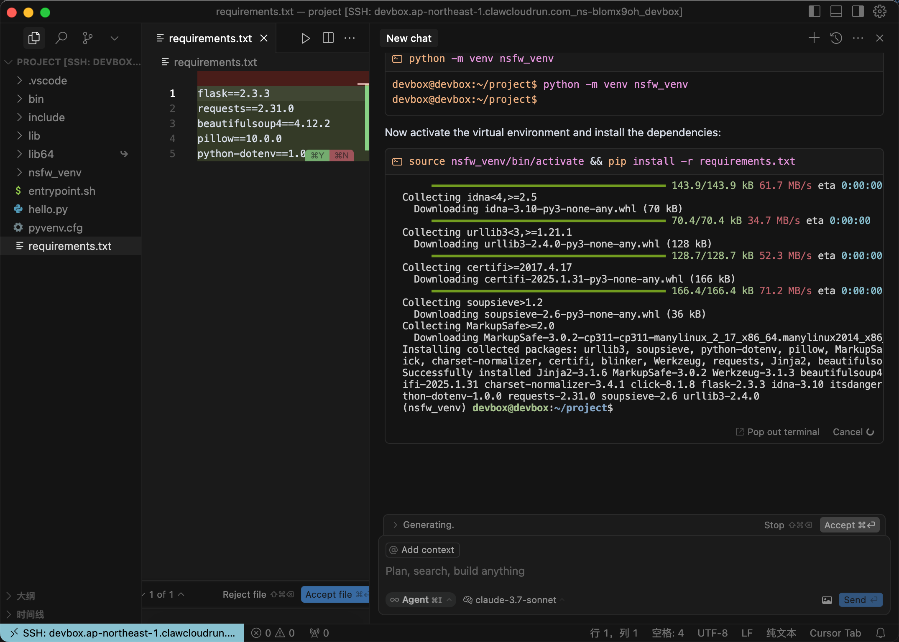

6. **Taking a Quick Break**
    I noticed the process was taking a bit longer, so I grabbed a tissue and headed to the restroom to catch a few TikTok videos—a classic moment of slacking off 🤣.

7. **Back Online**
    When I returned, the service had spun up. Even though it’s running on localhost:5000, remember that it’s actually running in the Devbox—not on my local machine. Rest assured, my main system remains clean and free from extra dependencies:

   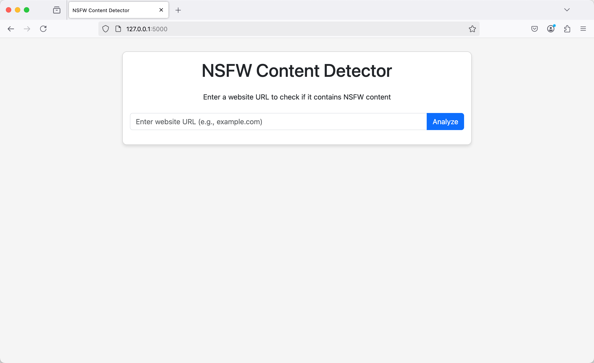

8. **Testing with a NSFW Link**
    Next, I tested it by entering a link from a notorious adult site (P-site) to see if it would detect the explicit content.

   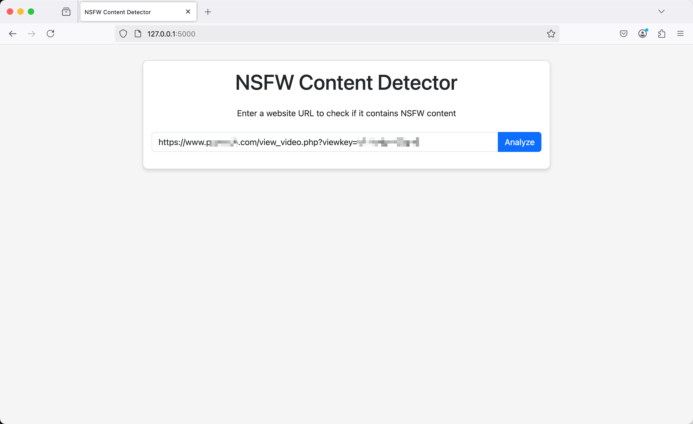

9. **Verifying with a Known ‘Problematic’ Link**
    I also threw in a “troublesome” link that a colleague had sent me before. Sure enough, the checker flagged it as NSFW.

   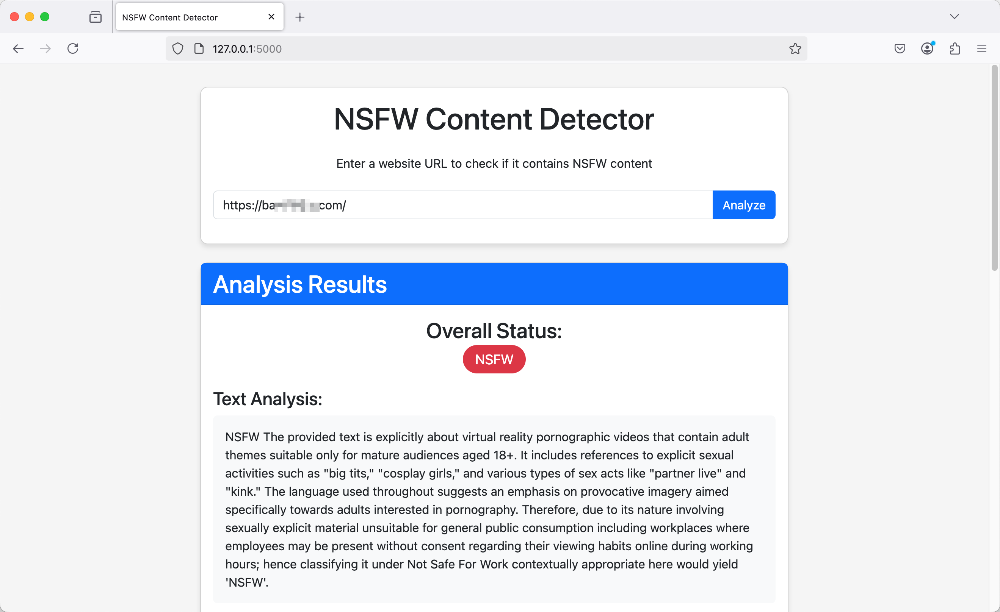

10. **Testing a Legitimate Site**
     Finally, I tested a normal website to confirm that the tool only flags NSFW content. If even regular links were marked NSFW, I’d have to avoid the internet entirely 🛜, and I can’t have that.

    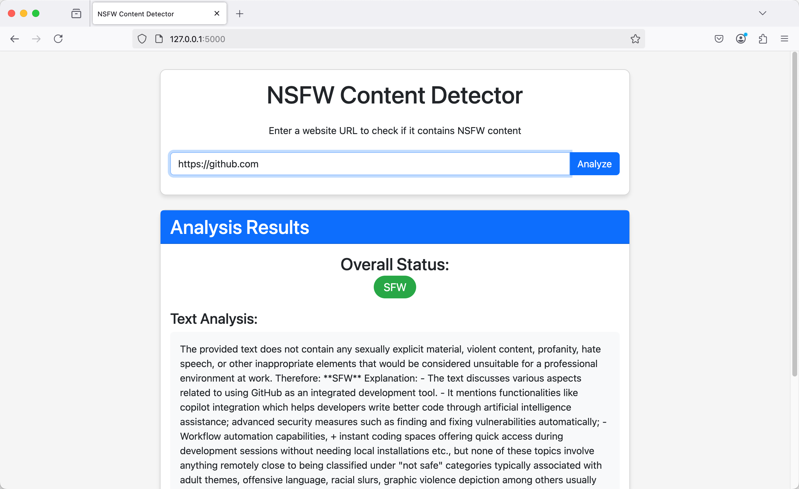

11. **Success!**
     Everything worked perfectly. And the best part? I did it all with one simple prompt—even though I’m someone who can’t write a single line of code.

# Deploying the Website

1. **Prepare for Deployment**
    Now it’s time to turn the code into a fully-fledged website. Since the program is being auto-started by the large model, I wasn’t sure what the actual startup command was. I had to ask. Also, when I created the Devbox, I initially set the runtime port to 8080. So I asked Cursor to change the port from 5000 to 8080.

   The prompt was as follows:

   > Please tell me what the startup command is for running this Python program, and change the program's running port from 5000 to 8080.

2. **Get the Startup Command**
    Cursor responded by providing the startup command:

   ```bash
   source nsfw_venv/bin/activate && python app.py
   ```

   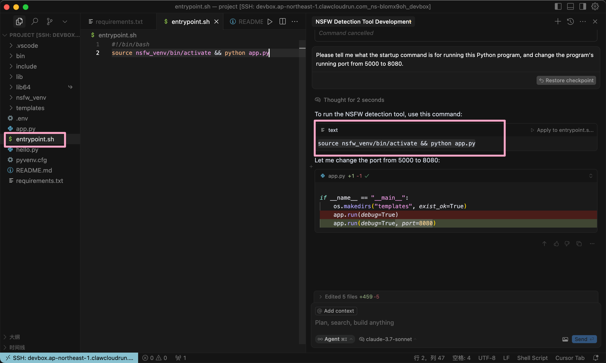

3. **Update the Entrypoint**
    I then added this startup command to the `entrypoint.sh` file.

4. **Release the Build**
    I navigated to the Devbox page and clicked the **Release** button.

   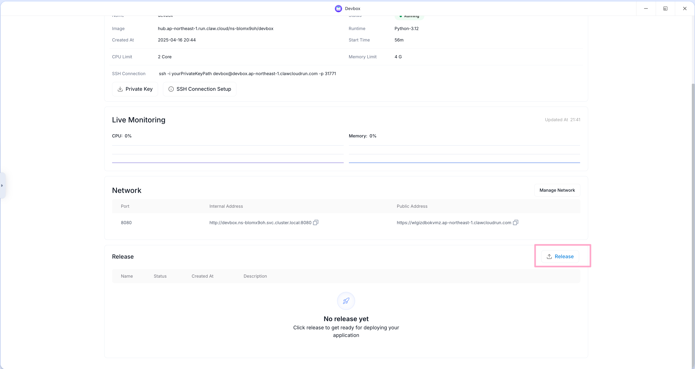

5. **First Version Deployed**
    And just like that, my very first version—numbered `1.0.0`—was ready to be released!!!! 😎😎😎

   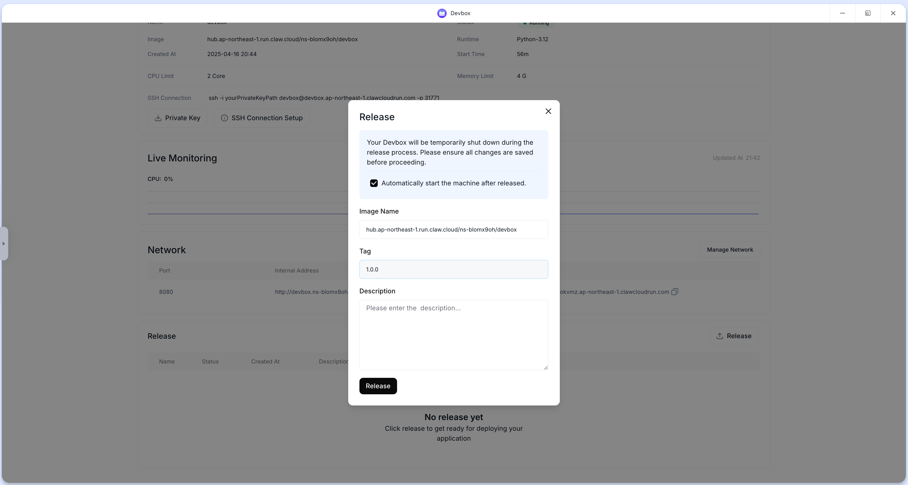

6. **Deploy the Release**
    Next, I clicked **Deploy** to launch that version.

   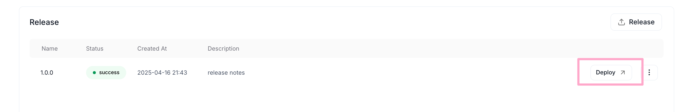

7. **Choose a Smaller Configuration**
    I selected a smaller configuration to run the application.

   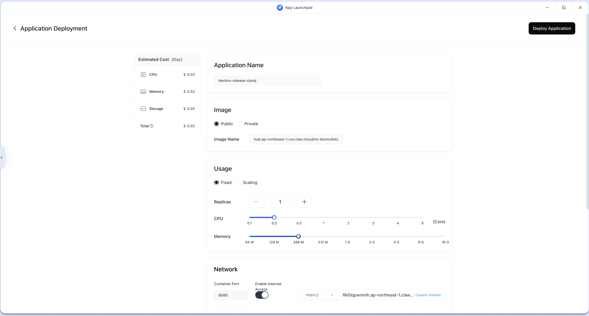

8. **Final Wait and Go Live**
    After a short wait (about 5 minutes—you might even get in another quick restroom break), my NSFW detection website was finally live. Now, simply click **Public Address** to check it out.

   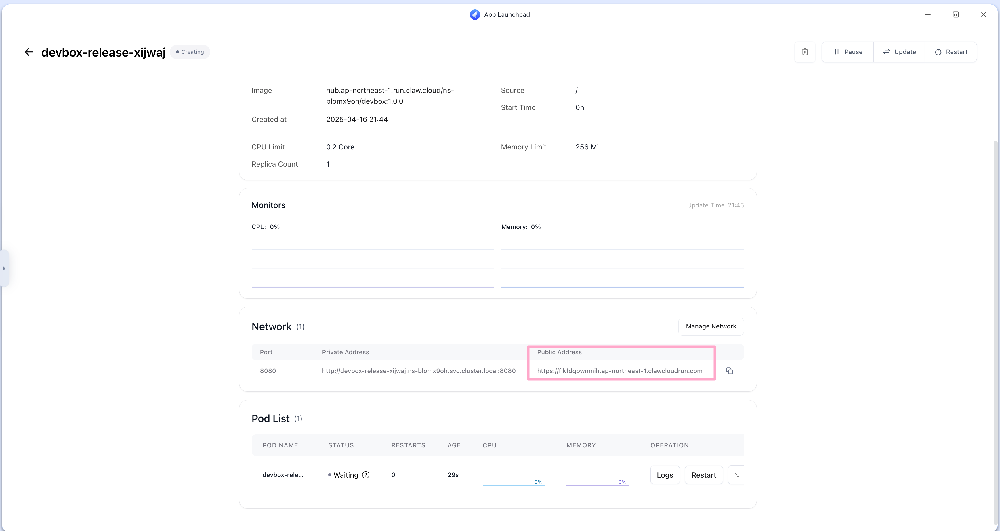

# Wrapping Up

We’ve finished building the app, but since the Devbox was only needed during development, there’s no reason to keep it running at high capacity.

However, I might want to iterate on the code with further improvements using a large model later on. To avoid ongoing charges, I can use the **Pause** option on Devbox. Pausing the Devbox stops billing for CPU and memory usage—only network usage fees remain.

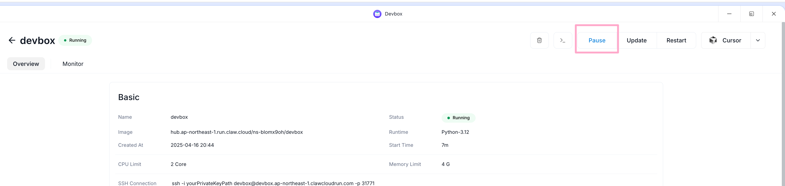

Currently, my NSFW application is configured with 0.2 vCPU and 256MB memory, costing just 0.05perday—that’sabout0.05 per day—that’s about 0.05perday—that’sabout0.15 per month! With ClawCloud Run’s free monthly credit of $5, I’m essentially running this app for free. Amazing!